## WARNING
1. This is risky,by nature.
2. Your safety is extremely important 
3. Safe malware handling procedures are critical. 
4. Proper handling is covered extensively in the safety always! section of this couse 
5. It never hurts to double check


## Downloading VirtualBox
### References:

-   VirtualBox Download Link: [https://www.virtualbox.org/wiki/Downloads](https://www.virtualbox.org/wiki/Downloads)
-   Install VirtualBox on Mac: [https://cs.hofstra.edu/docs/pages/guides/vbox_mac.html](https://cs.hofstra.edu/docs/pages/guides/vbox_mac.html)
-   Install VirtualBox on Linux: [https://phoenixnap.com/kb/install-virtualbox-on-ubuntu](https://phoenixnap.com/kb/install-virtualbox-on-ubuntu)

##  Downloading Windows 10

** You can find the Windows 10 image for this course here: **

[https://www.microsoft.com/en-us/evalcenter/download-windows-10-enterprise](https://www.microsoft.com/en-us/evalcenter/download-windows-10-enterprise)

The website looks different than how it appears in the course video, but the ISO is now available there. Select the 64-bit image.

## Setting Up the Windows 10 VM

## Downloading REMnux
### References:

-   Download REMnux: [https://remnux.org/#distro](https://remnux.org/#distro)

##  Course Lab Repo Link
The labs for this course are available here: [https://github.com/HuskyHacks/PMAT-labs](https://github.com/HuskyHacks/PMAT-labs)

This repo has all of the malware needed to complete this course. Please use this link and view the next video, "Course Lab Repo Download & Lab Orientation" for instructions on how to get started with the repo.


****
## Analysis Network Setup

*****


## INetSim Setup


****


## Course Lab Repo Download & Lab Orientation

Taking a Snapshot Before First Detonation

### Sample for this section:

**Ransomware.wannacry.exe.malz.7z**

##  Detonating Our First Sample

### Sample for this section:

PMAT-labs/labs/4-1.Bossfight-wannacry.exe/Ransomware.wannacry.exe.malz.7z

**Please Note:** For this detonation, **turn off INetSim** before detonating. WannaCry will not detonate if INetSim is running.

****

## Basic Malware Handling
### Sample for this section:

Malware.Calc.exe.7z

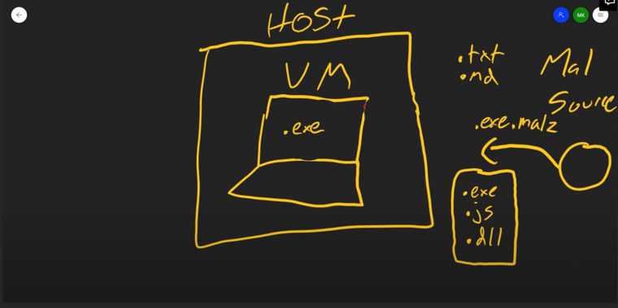

Mitigating the risks

*** 
## Safe Malware Sourcing
### References:

-   theZoo: [https://github.com/ytisf/theZoo](https://github.com/ytisf/theZoo)
-   VXUnderground GitHub repo: [https://github.com/vxunderground/MalwareSourceCode](https://github.com/vxunderground/MalwareSourceCode)
-   Zeltser Resources: [https://zeltser.com/malware-sample-sources/]

# Basic Static analysis


Getting the file hash 
1. Using powershell
```python
Get-Filehash < filename> -Algorithm md5
```
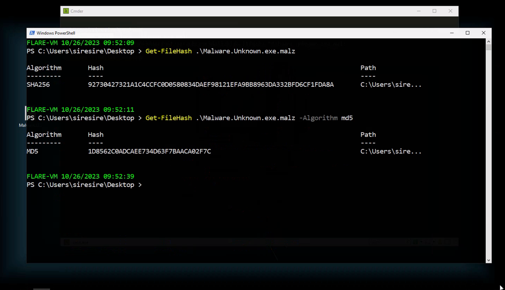
2. Cmder
```python
sha256sum.exe <filename>
```


filehashes 
```python
sha256sum = 92730427321a1c4ccfc0d0580834daef98121efa9bb8963da332bfd6cf1fda8a
```
```python
md5 = 1d8562c0adcaee734d63f7baaca02f7c
```

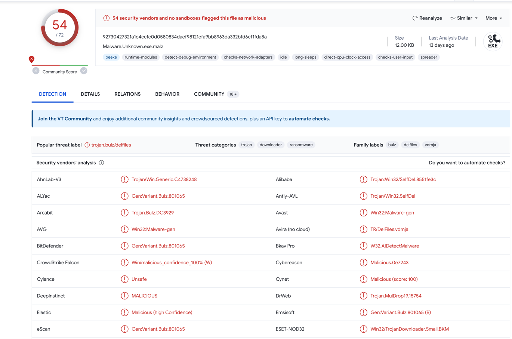

## Strings & FLOSS: Static String Analysis

Tip: FLOSS can be run with the "-n" argument to specify your desired minimum string length. Sometimes, longer strings can be more useful to an analyst than your standard string of len(4).

For example, if I want to pull all strings of length 6 or greater, I can issue the following command:

```python
floss.exe -n 6 [malware_name.exe]
```


found interesting strings 


*** 
## Analyzing the Import Address Table

MZ means that the program is portable executable 
The 1st thing to look at is to go right down at the image file header which is under the image image_nt_header section and one set of bites inside the executable will have the timestamp  of a compilation of this particular executable


The Balkans Delfi, malware  compiler  will always have a timestamp of 1990
After the timestamp, we check out the dot text section 


So we checked the virtual size and size of the raw data. You can compare these values which are written in hexadecimal  and if the values are kinda similar we can ascertain  that the size of the raw data of the binary is roughly the same as the virtual size 
Virtual size is the amount of data on disk when the binary is run 
If the difference is much much higher, we can surmise that there is more to this binary  than is initially available to us and we can think that that is a packed binary 

Lastly,check SECTION .rdata and check out the IMPORT Address Table 
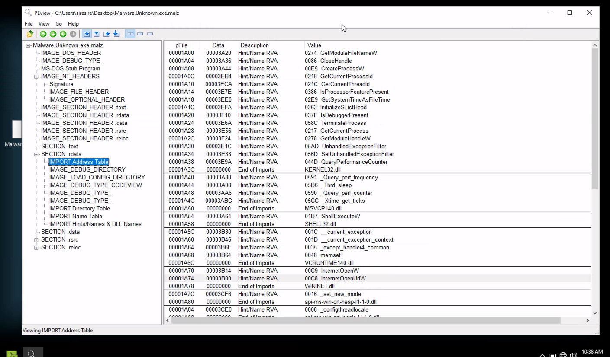
To understand this section,we need to understand win23 or Windows API

*** 

## Introduction to the Windows API

Windows APIs are **dynamic-link libraries (DLLs) that are part of the Windows operating system**.
  

The Windows API (application programming interface) **allows user-written programs to interact with Windows**, for example to display things on screen and get input from mouse and keyboard. All Windows programs except console programs must interact with the Windows API regardless of the language.
  

A dynamic link library (DLL) is **a collection of small programs that larger programs can load when needed to complete specific tasks**. The small program, called a DLL file, contains instructions that help the larger program handle what may not be a core function of the original program.


*** 
## MalAPI.io
Site: [https://malapi.io](https://malapi.io/)

Twitter: [https://twitter.com/mrd0x](https://twitter.com/mrd0x)

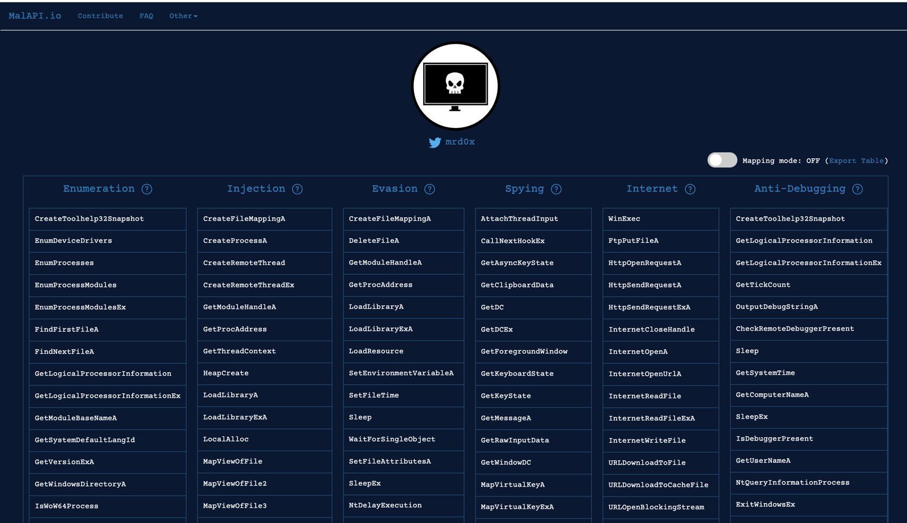

*** 
## To Pack Or Not To Pack: Packed Malware Analysis

**Paked** malware is basically is a kind like a compression or encryption mechanism to make a piece of malware look different than it’s original source 
Basically packing of malwares is just to make an exiting piece of malware look different on disk to antivirus and other kind security products 
Diifrence in  virtual size and size of the raw data


This is string difference 


The difference in IMPORT Table Address btw packed malware and unpacked


*** 
## Combining Analysis Methods: PEStudio
Malware.Unknown.exe.malz/Malware.Unknown.exe.7z
PEStudio does a bunch of things automatically making our earlier stages of malware of static analysis very simple and straightforward.

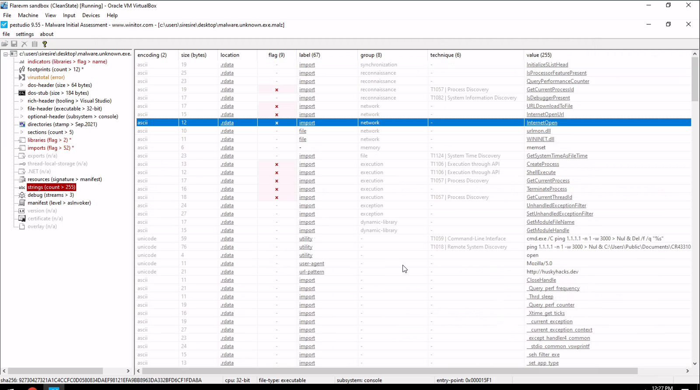

***

### notes 
```

File Hash & VT Analysis 
SHA256   :    
92730427321A1C4CCFC0D0580834DAEF98121EFA9BB8963DA332BFD6CF1FDA8A

MD5  :
1D8562C0ADCAEE734D63F7BAACA02F7C

Basic Static analysis 
### **Strings and Floss Output**

FLOSS static Unicode strings
jjjj
cmd.exe /C ping 1.1.1.1 -n 1 -w 3000 > Nul & Del /f /q "%s"
http://ssl-6582datamanager.helpdeskbros.local/favicon.ico
C:\Users\Public\Documents\CR433101.dat.exe
Mozilla/5.0
http://huskyhacks.dev
ping 1.1.1.1 -n 1 -w 3000 > Nul & C:\Users\Public\Documents\CR433101.dat.exe
open


FLOSS decoded 0 strings

FLOSS extracted 2 stackstrings
<2_/
ineIGenu
```

*** 
# Dynamic analysis 

-its also call Heuristics /behavioral analysis 
This is going  to tell use about the host indicators or network indicators  On the network side,the binary call out to a domain maybe download a file

Network signatures 
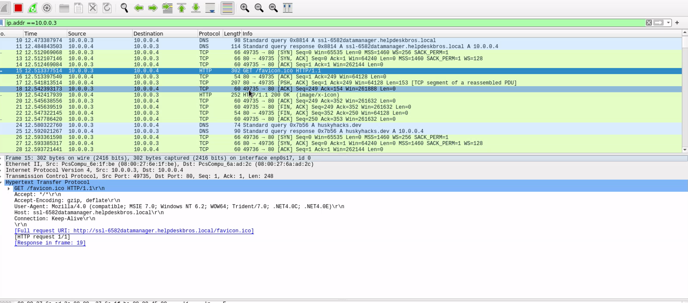

*** 

## Host-Based Indicators: Procmon Part I

### Sample for this section:

Malware.Unknown.exe.malz/Malware.Unknown.exe.7z

(Note: we are still using the sample from the Basic Static Analysis section even though we are now in the Basic Dynamic section!)

We use procmon 

For host indicators
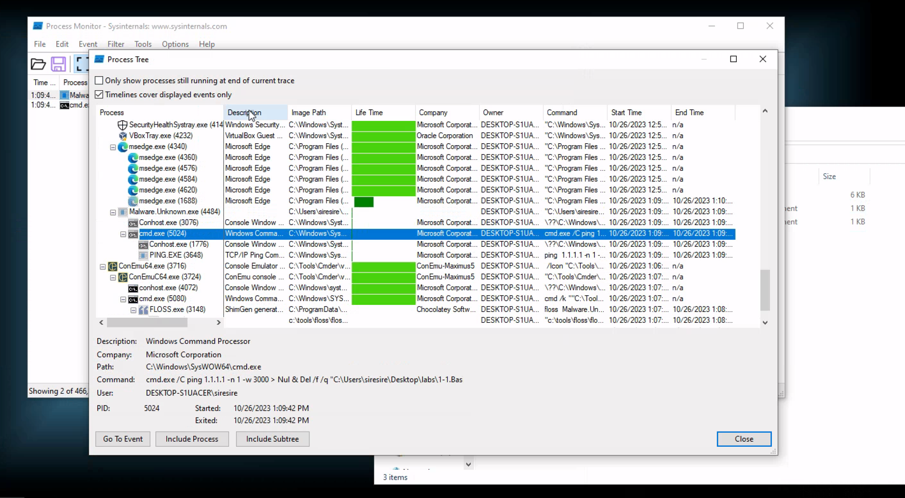
This malware is reaching out to a particular url 
It creates a file on the desktop 

***  
## Host-Based Indicators: Procmon Part II

### Sample for this section:
##### RAT.CmdSocket.exe.malz
**PMAT-labs/labs/1-1.BasicStaticAnalysis/Malware.Unknown.exe.malz/Malware.Unknown.exe.7z**

(Note: we are still using the sample from the Basic Static Analysis section even though we are now in the Basic Dynamic section!)
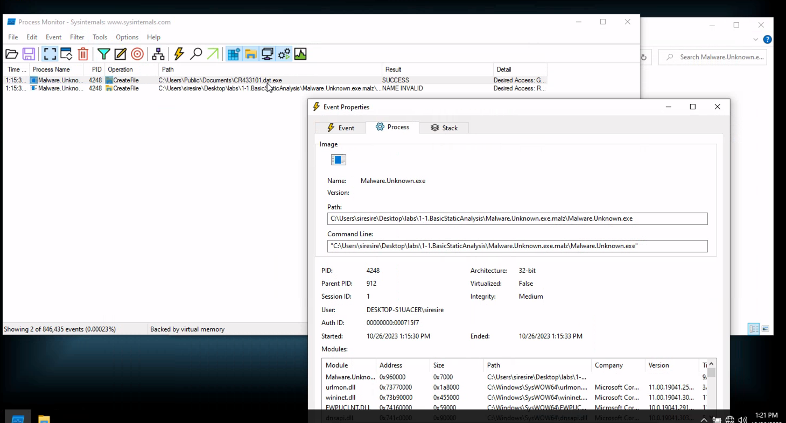

```
Program execution flow 
	If URL exists:
		Download favicon.ico
		Write to disk (CR433101.dat.exe) in public/documents 
		Run favicon.ico (CR433101.dat.exe)
	If the URL doesn’t exist
		Delete from disk
		Do not run
```

After all we can give this malware a name called:
Dropper.DownloadFromURL.exe


## Dynamic Analysis of Unknown Binaries Part I: Analyzing Wireshark
### Sample for this section:
**RAT.Unknown.exe.malz/RAT.Unknown.exe.malz.7z**
### References:
-   For Tool Troubleshooting and the SysInternals Suite, reference "Tool Troubleshooting" from the Safety Always! section of this course.
challenge :
- 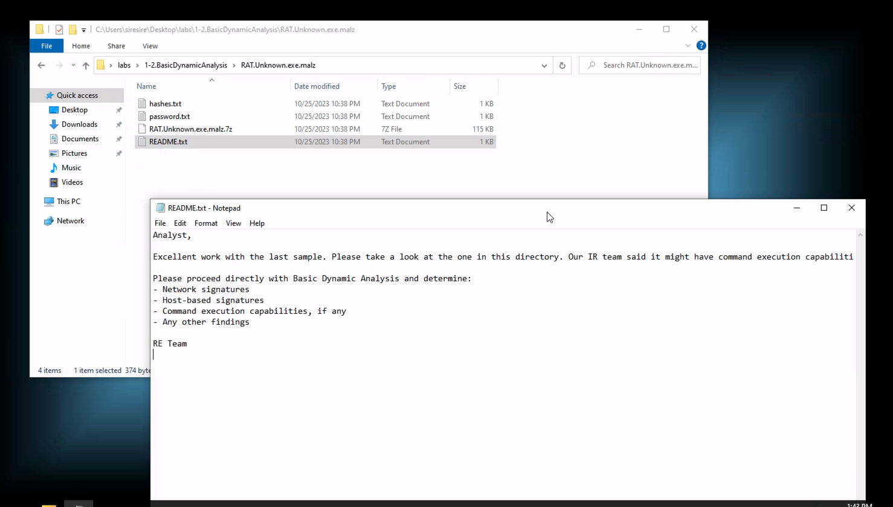

***
Static analysis with floss 

interesting strings
```
@https
@No ur scheme supplied.
InternetOpenl
InternetOpenUrlW
@wininet
@wininet
MultiByteToWideChar
@kernel32
@kerne132
MessageBoxh
@user32
@user32
@+] what command can I run for you
@[+] online
@NO SOUP FOR YOU
@\mscordll.exe
@Nim httpclient/1.0.6
@/msdcorelib.exe
@AppData\Roaming\Microsoft\Windows\Start Menu\Programs\Startup
Qintrt explr
@http://servl.ec2-102-95-13-2-ubuntu.local
```

using pestudio:


#### After running, the initial malware detonation 
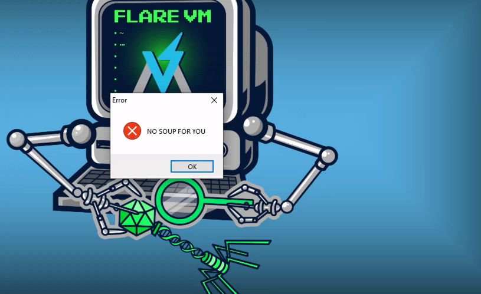

### Wireshark packet analysis 


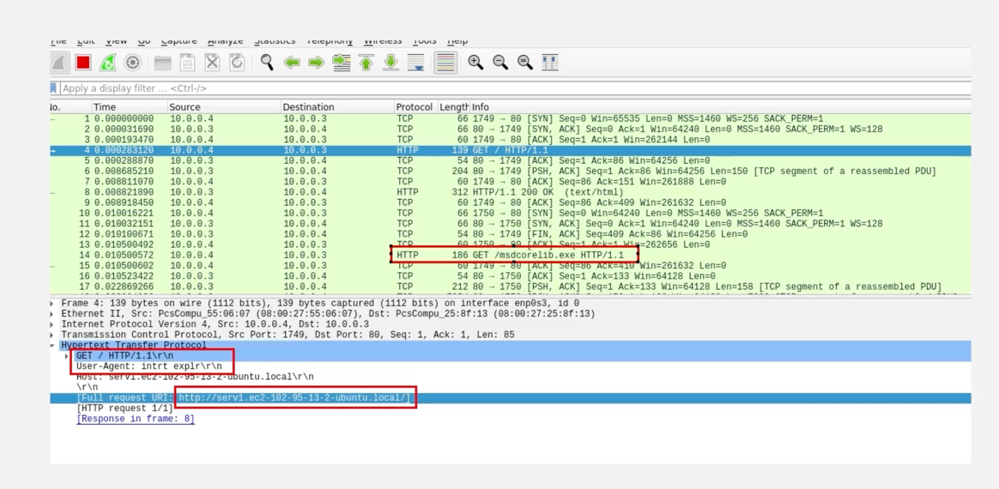

Here we have a potential URL ``http://serv1.ec2-102-95-13-2-ubuntu.lical``   and a get request with a very interesting user agent 
and another HTTP with a get request for ``msdecorelab.exe`` and it may be a second-stage payload 
This information correlated with the strings we found after running the floss binary 

Focus on Potential file download :
	`mscordll.exe`

Hostbase indicated 

Following the tcp-stream


```python
@/msdcorelib.exe
@AppData\Roaming\Microsoft\Windows\Start 
Menu\Programs\Startup
```
Host base indicators 

The start-up directory is commonly used to put programs to start when someone logs in and a common vector that malware abuses 


####  TCP sockets listening states


#### command injection capability by base64 encoded data from sockets on TCP 5555

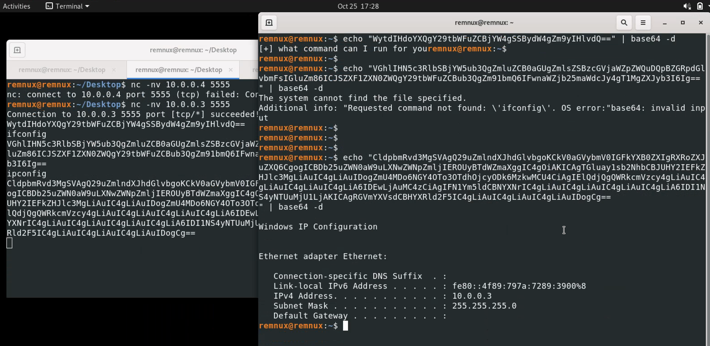


#### A bind shell with command injection capability 


